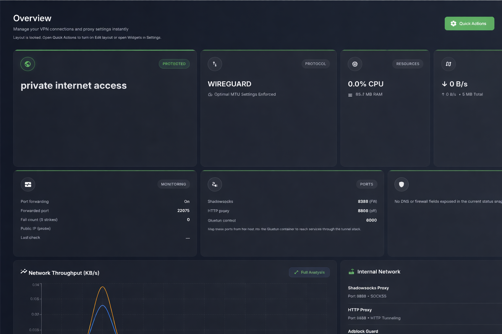

# Gluetun-GUI

A web UI for [**Gluetun**](https://github.com/qdm12/gluetun): change VPN settings, watch status and logs, and let the app **recreate the Gluetun container** over the Docker API — no manual `docker run` env juggling for day‑to‑day changes.

[](https://hub.docker.com/r/raddadengineer/gluetun-gui)

## Screenshots



## Setup (Docker)

1. **Install** [Docker](https://docs.docker.com/get-docker/) with Compose on the machine that will run the VPN stack.

2. **Project folder** — Clone this repo **or** copy [`docker-compose.yml`](docker-compose.yml) into a folder that has an empty **`data/`** directory next to the compose file (the repo already has `data/` for local dev; for a minimal deploy, `mkdir data` is enough).

3. **Environment variables** — set these on the **`gluetun-gui`** service (Compose `environment:` or `docker run -e`). The repo compose already sets **`DATA_DIR`**.

   | Variable | Compose value | Notes |
   | --- | --- | --- |
   | **`DATA_DIR`** | `/data` | Required for persistence; pair with volume `./data:/data`. |
   | **`JWT_SECRET`** | _(your secret)_ | Optional; if omitted, a random secret is stored under `${DATA_DIR}/jwt-secret`. |
   | **`JWT_EXPIRES_IN`** | `24h` | Optional token lifetime. |
   | **`GLUETUN_CONTAINER_NAME`** | `gluetun` | Optional; must match the VPN service `container_name`. |
   | **`GUI_AUTOSTART_GLUETUN`** | `on` | Optional; set `off` to skip startup apply. Can also live in `gui-config.env`. |
   | **`CORS_ORIGIN`** | `http://localhost:3011` | Optional; set if the browser origin differs from the API default (`http://localhost:3000`). |
   | **`PORT`** | `3000` | Listen port **inside** the container (usually omit; host mapping is separate). |

   ```yaml
   environment:
     - DATA_DIR=/data
     # Optional:
     # - JWT_SECRET=change-me
     # - JWT_EXPIRES_IN=24h
     # - GLUETUN_CONTAINER_NAME=gluetun
     # - GUI_AUTOSTART_GLUETUN=on
     # - CORS_ORIGIN=http://localhost:3011
   ```

   **`GUI_PASSWORD`**, monitor/integration **`GUI_*`** keys, and VPN credentials belong in **`data/gui-config.env`** (Settings UI) — not as required Compose env. The **`gluetun`** service needs no `env_file`. Full catalog: **[docs/ENVIRONMENT.md](docs/ENVIRONMENT.md)**.

4. **Start the stack**

   ```bash
   docker compose pull
   docker compose up -d
   ```

5. **Open the UI** — [http://localhost:3011](http://localhost:3011) (repo compose maps host **`3011`** → container **`3000`**; use your host and mapped port if you changed it).

6. **Sign in** — Default password is **`gluetun-admin`** until you set **`GUI_PASSWORD`** in **Settings → This app** or in `data/gui-config.env`. See [docs/OPERATIONS.md](docs/OPERATIONS.md).

7. **Configure the VPN** in **Settings** (provider, region, keys, …) and **Save**. The UI shows a diff, then recreates the **`gluetun`** container with the new environment.

**Images:** GUI `raddadengineer/gluetun-gui:latest` · VPN `qmcgaw/gluetun:latest`. More detail (ports, volumes, updates): **[docs/DOCKER.md](docs/DOCKER.md)**.

## What you get (short)

- **Dashboard** — Tunnel state, resources, quick actions (restart, VPN test, failover test).
- **Network & logs** — Traffic views, session history export, live logs.
- **Settings** — Tabs that map to Gluetun env vars (PIA WireGuard/OpenVPN, other providers, firewall, DNS, proxies, advanced).
- **Background monitor** — Optional PIA region rotation on repeated failures (full behavior: **[docs/MONITORING.md](docs/MONITORING.md)**).

Full feature list: **[docs/FEATURES.md](docs/FEATURES.md)**.

## Documentation

- **[docs/README.md](docs/README.md)** — full index (Docker, PIA, monitoring, proxy, troubleshooting, …)
- **[docs/ENVIRONMENT.md](docs/ENVIRONMENT.md)** — container, build, and `gui-config.env` variables
- **[docs/TROUBLESHOOTING.md](docs/TROUBLESHOOTING.md)** — common failures
- **[docs/ARCHITECTURE.md](docs/ARCHITECTURE.md)** — diagrams, persistence, API route tables

## Project meta

- **[LICENSE](LICENSE)** — ISC
- **[CHANGELOG.md](CHANGELOG.md)** — release notes
- **[`patches/README.md`](patches/README.md)** — build-time patches (e.g. `pia-wg-config` TLS fallback)
- **[CONTRIBUTING.md](CONTRIBUTING.md)** — local dev and PR expectations
- **[SECURITY.md](SECURITY.md)** — how to report vulnerabilities

## Developing locally

Frontend (`app/`) and API (`server/`): see **[app/README.md](app/README.md)**.
