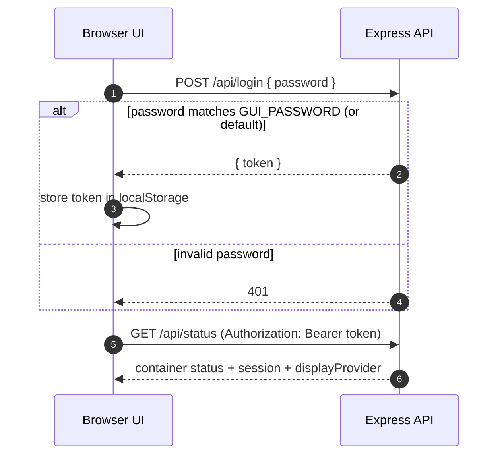
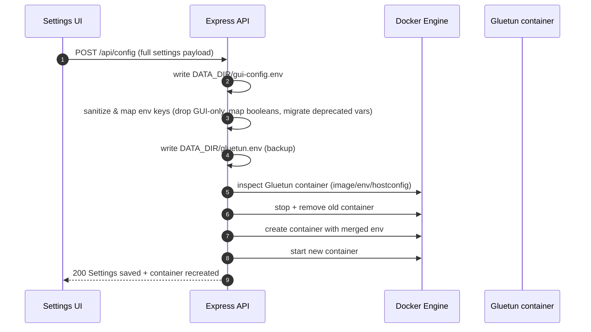
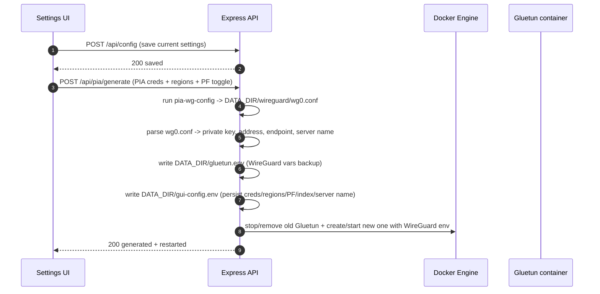
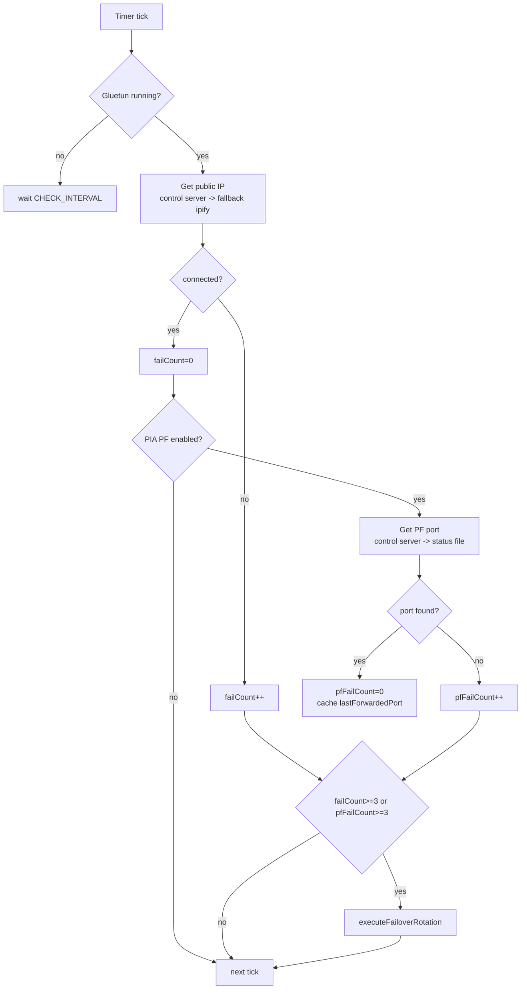

# Architecture & Data Flow

This document explains how **Gluetun-GUI** works end-to-end: containers, persistence, API surface, and the main runtime flows (save config, generate WireGuard keys, monitoring, and auto-failover).

## High-level topology

```mermaid
flowchart LR
  U[Browser UI<br/>React (Vite build)] -->|REST / SSE<br/>Bearer JWT| API[gluetun-gui<br/>Express API :3000]

  subgraph GUI_DATA[Persistent data (DATA_DIR)]
    ENV[gui-config.env<br/>GUI source-of-truth]
    SESS[sessions.json<br/>session history]
    WG[wireguard/wg0.conf<br/>generated WG config]
    GLU[gluetun.env<br/>flat env backup]
  end

  API <-->|read/write| GUI_DATA
  API -->|Docker API via socket| DOCKER[(docker.sock)]
  DOCKER --> G[gluetun<br/>qmcgaw/gluetun]
  API -->|Docker stats / inspect / logs| G

  G -->|VPN tunnel| NET[(Internet)]
```

## Components

- **UI (`app/`)**
  - React pages call the Express backend under `/api/*`.
  - Authentication is a JWT stored in `localStorage` and sent as `Authorization: Bearer <token>`.
  - Logs are streamed via Server-Sent Events (SSE) from `/api/logs`.

- **API (`server/index.js`)**
  - Reads/writes the GUI configuration, recreates the Gluetun container, runs PIA WireGuard generation, maintains session history, and runs a background monitor.
  - Uses Docker socket access (via `dockerode`) to inspect/recreate containers and stream logs.

- **Persistence (`DATA_DIR`)**
  - `gui-config.env`: **authoritative GUI config** (what you see in Settings).
  - `gluetun.env`: a **flat backup** of the last applied Gluetun env values.
  - `wireguard/wg0.conf`: last generated PIA WG config (used for parsing keys, endpoint, server name).
  - `sessions.json`: session history (bandwidth deltas and metadata).

## Authentication flow



## Config save → apply to Gluetun

**Goal:** user edits Settings → presses Save → the GUI persists config and immediately applies it to the running Gluetun container.



### Why “GUI provider” and “container provider” can differ

For **PIA WireGuard**, the GUI stores `VPN_SERVICE_PROVIDER=private internet access`, but Gluetun must run with `VPN_SERVICE_PROVIDER=custom` (because the GUI injects explicit WireGuard keys/endpoints). The Dashboard therefore uses the GUI config as the user-facing provider label.

## PIA WireGuard “Generate Keys & Connect”

**Goal:** generate a fresh WireGuard config from PIA’s API, update GUI config + Gluetun env, and restart Gluetun to connect.



## Monitoring & auto-failover (PIA)

The API runs a background loop (delayed start) that:

- Checks connectivity using:
  - Gluetun control server `/v1/publicip/ip` **if available**, otherwise
  - a fallback external request (`api.ipify.org`) so monitoring works even when the control server is auth-protected.
- If PIA port-forwarding is enabled:
  - tries control server `/v1/portforward`,
  - falls back to reading `/tmp/gluetun/forwarded_port` inside the container.
- If failures exceed thresholds, it rotates regions (if you selected more than one).



### Failover rotation logic

- Loads GUI config from `gui-config.env`.
- Computes the active region list:
  - WireGuard: `PIA_WG_REGIONS` (or `PIA_REGIONS` fallback)
  - OpenVPN: `PIA_OPENVPN_REGIONS` (or `PIA_REGIONS` fallback)
- Advances `PIA_REGION_INDEX` and persists it.
- For WireGuard, regenerates using `pia-wg-config` for the next region.
- For OpenVPN (PIA), applies `SERVER_REGIONS=<next region>` and recreates container.

## API surface (main routes)

| Route | Method | Purpose |
|------|--------|---------|
| `/api/login` | POST | Authenticate and get JWT |
| `/api/status` | GET | Gluetun container status + session + GUI display provider |
| `/api/metrics` | GET | Docker stats for Gluetun (CPU/RAM/network) |
| `/api/config` | GET/POST | Read/write GUI config and apply to Gluetun |
| `/api/logs` | GET (SSE) | Multiplexed logs: Gluetun + GUI |
| `/api/sessions` | GET/DELETE | Session history |
| `/api/pia/regions` | GET | PIA WireGuard region list (proxy) |
| `/api/pia/generate` | POST | Generate WG config from PIA and reconnect |
| `/api/pia/monitoring` | GET | Monitor snapshot (fail counts + PF port) |
| `/api/test-failover` | POST | Manually trigger region rotation |

