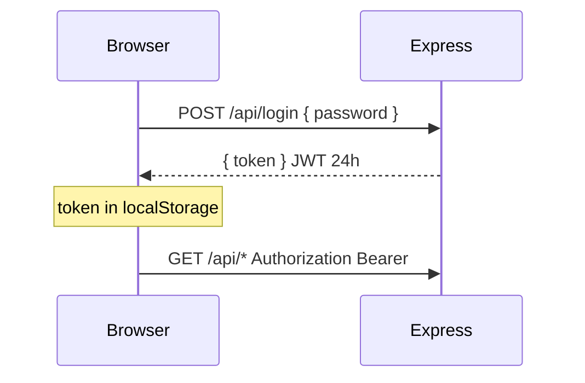
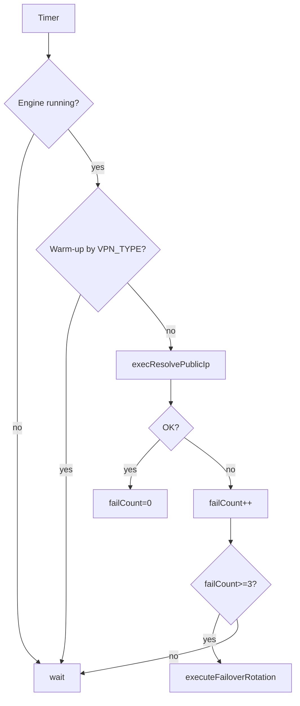

# Architecture & data flow

This document describes **Gluetun-GUI**: containers, persistence, API routes, and main flows (settings, PIA WireGuard/OpenVPN, monitoring, failover, backup).

Other guides: **[README.md](README.md)** (index), **[FEATURES.md](FEATURES.md)**, **[DOCKER.md](DOCKER.md)**, **[ENVIRONMENT.md](ENVIRONMENT.md)**, **[CLIENT-SERVICES.md](CLIENT-SERVICES.md)**, **[PIA.md](PIA.md)**, **[MONITORING.md](MONITORING.md)**, **[REVERSE-PROXY.md](REVERSE-PROXY.md)**, **[TROUBLESHOOTING.md](TROUBLESHOOTING.md)**, **[OPERATIONS.md](OPERATIONS.md)**.

## Topology

```mermaid
flowchart LR
  U[Browser UI<br/>React (Vite)] -->|REST / SSE<br/>Bearer JWT| API[gluetun-gui<br/>Express :3000]

  subgraph GUI_DATA[Persistent data DATA_DIR]
    ENV[gui-config.env<br/>GUI source of truth]
    SESS[sessions.json<br/>session history]
    WG[wireguard/wg0.conf<br/>PIA WG output]
    GLU[gluetun.env<br/>last Gluetun env backup]
  end

  API <-->|read/write| GUI_DATA
  API -->|Docker API| DOCKER[(docker.sock)]
  DOCKER --> G[gluetun engine<br/>qmcgaw/gluetun]
  API -->|stats / inspect / logs / exec| G

  G -->|VPN tunnel| NET[(Internet)]
```

## Components

| Layer | Role |
|--------|------|
| **UI (`app/`)** | React (Vite). JWT in `localStorage`. Themes and notification prefs in `localStorage`. SSE for `/api/logs`. |
| **API (`server/index.js`)** | Express: config, Docker lifecycle, PIA automation, sessions, monitoring loop, static SPA in production. |
| **Engine container** | Resolved as `findGluetunEngineContainer()`: prefers name `/gluetun`, else first `gluetun` name not containing `gui`. Metrics, status, and monitor target this container. |

### Persistence (`DATA_DIR` or legacy paths)

| File | Purpose |
|------|---------|
| `gui-config.env` | Authoritative settings from the UI (and secrets such as `GUI_PASSWORD`, PIA creds). |
| `gluetun.env` | Flat backup of the last env passed into Gluetun on recreate. |
| `wireguard/wg0.conf` | Last PIA WireGuard file from `pia-wg-config` (parsed for keys, endpoint, `SERVER_NAMES`). |
| `sessions.json` | VPN session history (bandwidth, metadata). |

## Authentication



Password source: `GUI_PASSWORD` in `gui-config.env`, default `gluetun-admin`. Change under **Settings → This app → GUI security**.

## Settings layout (tabs)

| Tab | Scope |
|-----|--------|
| **VPN & tunnel** | Provider, `VPN_TYPE`, PIA WireGuard / PIA OpenVPN panels, or generic provider server filters + WireGuard/OpenVPN fields. |
| **Firewall & ports** | `FIREWALL_*`, **`DNS_UPSTREAM_IPV6`** (IPv6 for Gluetun DNS upstream — same control as **DNS & blocklists → IPv6 DNS**), VPN port forwarding (`VPN_PORT_FORWARDING_*`). |
| **DNS & blocklists** | Resolvers, blocklists, DNS toggles including **`DNS_UPSTREAM_IPV6`**. Public IP logging is under **Gluetun advanced** (`PUBLICIP_*`). |
| **Local proxies** | Shadowsocks, HTTP proxy. |
| **This app** | Theme, GUI password, notifications, **config export/import** (browser only; not sent to Gluetun as env). |
| **Gluetun advanced** | Log level, health check, updater, system/identity (`TZ`, `PUBLICIP_ENABLED`, …), VPN hooks. |

> **IPv6 scope:** `DNS_UPSTREAM_IPV6` only affects how Gluetun reaches **DNS upstreams** (Gluetun also accepts legacy `DOT_IPV6`). Full stack IPv6 in the container is still governed by the host/Docker **`sysctls`**, not this GUI alone.

## Config save → Gluetun

```mermaid
sequenceDiagram
  participant UI as Settings
  participant API as Express
  participant D as Docker
  participant G as Gluetun

  UI->>API: POST /api/config (JSON body)
  API->>API: applyGuiConfiguration()
  Note over API: PIA OpenVPN: alias→region; PF on→drop non-PF regions; strip SERVER_*; copy PIA_*→OPENVPN_* if needed
  API->>API: write gui-config.env
  API->>API: build gluetun env (GUI-only keys removed, booleans on/off, WG custom mapping for PIA)
  API->>API: write gluetun.env
  API->>D: stop/remove engine + create/start merged env
  API-->>UI: 200 + message
```

**`applyGuiConfiguration`** is also used by **`POST /api/config/import`** (same pipeline as Save).

### `GET /api/config` (load for UI)

- Migrates deprecated env key names and may **rewrite `PIA_OPENVPN_REGIONS`** to Gluetun **region labels** (alias map from `servers.json`).
- When **`VPN_PORT_FORWARDING`** or **`PIA_PORT_FORWARDING`** is on, drops OpenVPN region tokens that have **no** `port_forward: true` server in Gluetun’s PIA OpenVPN data, then persists if changed.

### PIA WireGuard vs container `VPN_SERVICE_PROVIDER`

For **PIA WireGuard**, the GUI keeps `VPN_SERVICE_PROVIDER=private internet access` in `gui-config.env`, but Gluetun runs with **`custom`** and explicit `WIREGUARD_*` + optional `SERVER_NAMES`. The Dashboard uses **`/api/status`** fields `displayProvider` / `gui.VPN_SERVICE_PROVIDER` for the label.

### PIA OpenVPN (Gluetun region labels & port forwarding)

- Gluetun validates **`SERVER_REGIONS`** against **human-readable region labels** from `servers.json` (e.g. `DE Berlin`), **not** internal `server_name` tokens (e.g. `berlin422`). **`getPiaOpenVpnAliasToRegionMap`** maps aliases → region on save/import and in failover.
- **`PIA_OPENVPN_REGIONS`** stores the comma-separated failover list (labels). **`PIA_PORT_FORWARDING`** is shared with the WireGuard panel; OpenVPN also respects **`VPN_PORT_FORWARDING=on`** from **Firewall & ports** when deciding PF-only behavior.
- When port forwarding is **on** (`isPiaOpenVpnPortForwardingEnabled`), **`sanitizePiaOpenVpnServerSelection`** keeps only regions in **`getPiaOpenVpnPfRegionSet()`** (OpenVPN servers with `port_forward: true` in `servers.json`). Many **US state** regions have no such servers — prefer CA/EU-style labels or disable PF / use WireGuard for US + PF.
- **`GET /api/helpers/servers`** (PIA + OpenVPN): sorted unique regions in **`server_names`**. Query **`portForwardOnly=1`** or **`true`** restricts to PF-capable regions (the UI passes this when the PIA PF toggle or **`VPN_PORT_FORWARDING`** is on).
- Generic **`SERVER_*`** keys are stripped for PIA+OpenVPN so WireGuard-style ids cannot leak into the container.
- **`OPENVPN_USER` / `OPENVPN_PASSWORD`**: if empty but **`PIA_USERNAME` / `PIA_PASSWORD`** are set, they are copied before writing env.

### OpenVPN logs (`RTNETLINK … File exists`)

OpenVPN may log **route already exists** during reconnects inside Gluetun; that is often **harmless** if the tunnel still comes up. Repeated **healthcheck** restart loops are a separate issue — see the [Gluetun healthcheck FAQ](https://github.com/qdm12/gluetun-wiki/blob/main/faq/healthcheck.md). The PIA OpenVPN panel in Settings links this for operators.

## PIA WireGuard: Generate keys & connect

1. `POST /api/config` (save current form).
2. `POST /api/pia/generate` → runs `pia-wg-config`, parses `wg0.conf`, updates env files, recreates Gluetun with WireGuard + optional `SERVER_NAMES` for PF.

## Monitoring & failover

Background **`checkVPN`** (starts after a short delay):

1. Resolves the **engine** container (not the GUI container).
2. **Warm-up**: no connectivity failure counted while container age &lt; **120s** for **OpenVPN**, **25s** for **WireGuard** (tunnel/DNS/TLS need time).
3. **Public IP / connectivity** via **`execResolvePublicIp`** inside the container:
   - `http://127.0.0.1:8000/v1/publicip/ip` (Gluetun control server),
   - then `https://api.ipify.org?format=json`,
   - then plain **HTTP** `ipv4.icanhazip.com` or `checkip.amazonaws.com` (helps during OpenVPN bring-up when HTTPS is flaky).
4. Docker **`exec`** stdout is **demuxed** (multiplexed stream) before parsing JSON/text.
5. **PIA port forwarding** (if enabled in GUI env): control `/v1/portforward`, else read **`/tmp/gluetun/forwarded_port`**.
6. If **`failCount`** or **`pfFailCount`** ≥ **3**, runs **`executeFailoverRotation`**:
   - **WireGuard**: `pia-wg-config` for next region from `PIA_WG_REGIONS` / `PIA_REGIONS`.
   - **OpenVPN (PIA)**: next entry from **`PIA_OPENVPN_REGIONS` only**, resolved to a region label; if PF is on, skips regions not in **`getPiaOpenVpnPfRegionSet()`** before **`SERVER_REGIONS`** recreate.

Intervals: **`CHECK_INTERVAL`** (1 min) when unhealthy signals, **`HEALTHY_INTERVAL`** (15 min) when healthy.



## Backup & restore (homelab)

| Route | Method | Purpose |
|-------|--------|---------|
| `/api/config/export?redact=1` | GET | Download `gui-config.env`; secrets → `__REDACTED__`. |
| `/api/config/export` | GET | Full backup (sensitive). |
| `/api/config/import` | POST | `{ "envText": "KEY=value\\n..." }` — parse, **`applyGuiConfiguration`**, recreate Gluetun. |

## Other API routes

| Route | Method | Purpose |
|-------|--------|---------|
| `/api/login` | POST | JWT |
| `/api/status` | GET | Engine status, `env[]`, **`image`**, **`imageId`**, **`containerName`**, session, **`gui`** (`VPN_SERVICE_PROVIDER`, `VPN_TYPE`, …), **`displayProvider`** |
| `/api/metrics` | GET | Docker stats (engine container) |
| `/api/config` | GET / POST | Read JSON config (async migrations on GET) / save + recreate |
| `/api/logs` | GET (SSE) | Multiplexed Gluetun + GUI logs (`?token=` allowed) |
| `/api/sessions` | GET | Session history |
| `/api/sessions` | DELETE | Clear all sessions |
| `/api/sessions/:id` | DELETE | Delete one session by id |
| `/api/restart` | POST | Restart engine |
| `/api/stop` | POST | Stop engine |
| `/api/pia/regions` | GET | PIA WireGuard regions (PIA API proxy). Query `portForwardOnly=1` / `true` filters to PF-capable regions (`port_forward=true`). |
| `/api/pia/status` | GET | Last generate status |
| `/api/pia/generate` | POST | PIA WireGuard generate |
| `/api/pia/monitoring` | GET | Snapshot: `failCount`, `pfFailCount`, `connected`, `publicIp`, `port`, `checkInterval`, … |
| `/api/test-failover` | POST | Manual failover rotation |
| `/api/vpn/connectivity-test` | POST | One-shot **`execResolvePublicIp`** (does not advance monitor counters) |
| `/api/helpers/servers` | GET | Gluetun `servers.json` (and PIA WG special-case); query `provider`, `vpnType`, optional `country`, **`region`**, **`portForwardOnly`** (PIA OpenVPN PF-only region list) |

## In-app notifications (client only)

- **`NotificationsProvider`**: list, dedupe, `localStorage` prefs (`enabled`, per-`source`, per-level `toasts`).
- **Sources**: `settings`, `dashboard`, `monitor`, `logs`.
- Not persisted on server; no Gluetun env vars.

## Themes

- **`ThemeContext`**: `data-theme` on `<html>`, persisted in `localStorage`.
- Configured under **Settings → This app → Appearance**.

## Static production build

Express serves **`server/public`** (Vite `app` build output). Requests under **`/api/*`** must not be swallowed by the SPA fallback middleware.
